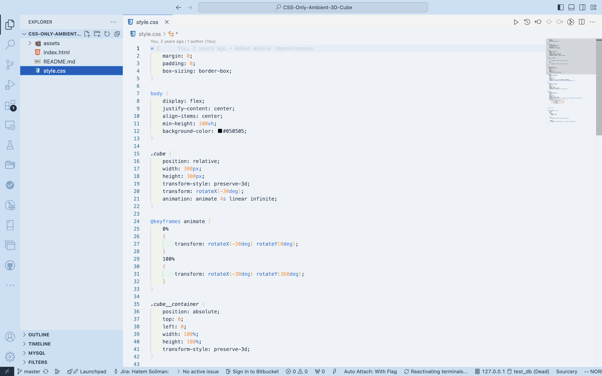

# 🐧 Polar Paradise Theme for VS Code 

```ascii
   __________
  /  ___    /\          Where penguins debug in style!
 /  /\  /  / /
/  /__\/__/ /     
\___________/   
   [|   |]     
   [|   |]      
   [|___|]
```

[](https://marketplace.visualstudio.com/items?itemName=your-name.polar-paradise)
[](https://marketplace.visualstudio.com/items?itemName=your-name.polar-paradise)
[](https://marketplace.visualstudio.com/items?itemName=your-name.polar-paradise)

## 🌟 Welcome to the Coolest Theme on VS Code! (Literally)

Tired of burning your retinas with dark themes? Bored of bland light themes? Say hello to **Polar Paradise** - where coding meets the Arctic! Our theme is cooler than a penguin's breakfast and smoother than a seal sliding on ice. 


## 🎨 Features That'll Make You Flap Your Flippers

- **Snow-White Background**: Easy on the eyes, just like fresh Antarctic snow ❄️
- **Glacier-Blue Accents**: Because we're fancy like that 🎩
- **Penguin-Approved Color Scheme**: Tested by real penguins* 
  
  *No penguins were disturbed during the making of this theme. They were too busy coding.

## 🎯 Perfect For:

- 🧊 Ice-cold debugging sessions
- 🐟 Fishing for bugs
- 🌨️ Coding through snowstorms
- 🏔️ Scaling Mount Documentation
- 🐧 Linux enthusiasts (obviously)

## 📸 Screenshots

### JavaScript/TypeScript


*So cool, it might freeze your syntax*

### Python


*Snake? No, we only have penguins here*

### HTML/CSS



*Web development with a side of snowflakes*

## 🎮 Installation

1. Open VS Code (preferably while wearing a tuxedo)
2. Go to Extensions
3. Search for "Polar Paradise"
4. Click Install
5. Do a happy feet dance 🕺

## 🐧 The Penguin Pledge

```bash
I solemnly swear that I am up to snow good
And will write the coolest code possible
While enjoying this ice-olated development environment
```

## 🧊 Cool Facts About This Theme

- It's so cool, your CPU temperature drops 5 degrees
- Penguins worldwide are switching their IDE themes
- 9 out of 10 polar bears recommend it*
  
  *The 10th bear was using Vim and couldn't exit to try our theme

## 🎵 Theme Song

> Write code, write code,
> In our polar paradise!
> Where bugs are cold,
> And syntax's nice!
> 
> [Sing to the tune of "Let It Go" - you know you want to](https://youtu.be/L0MK7qz13bU?si=OUHxJXL0Zc0pcBm7)

## 🤝 Contributing

Found a bug? (How? It's frozen solid!) 
Want to suggest improvements? 
Create an issue or PR! We welcome all contributors, especially those bringing fish. 🐠

## ⚖️ License

Creative Commons License - Feel free to share with all your penguin friends! - Feel free to share with all your penguin friends!

## 🎭 The Team Behind The Theme

- Chief Penguin Officer (CPO)
- Senior Ice Architect
- Junior Snowball Engineer
- Quality Assurance Seal

## 🌟 Special Thanks


To all the developers who code in cold conditions, this one's for you! 

---

<p align="center">
  
  <br>
  <em>Now waddle along and start coding!</em>
</p>

## 🎮 Pro Tips

- For maximum effect, play Arctic ambient sounds while coding
- Keep a cup of hot cocoa nearby (mandatory)
- If your code isn't working, try unfreezing it
- CTRL+ICE to save your work

---

Remember: Stay cool, code cool! 🧊✨

*PS: If you enjoyed this theme, consider leaving a ⭐️ or sharing it with your fellow Antarctic developers!*
